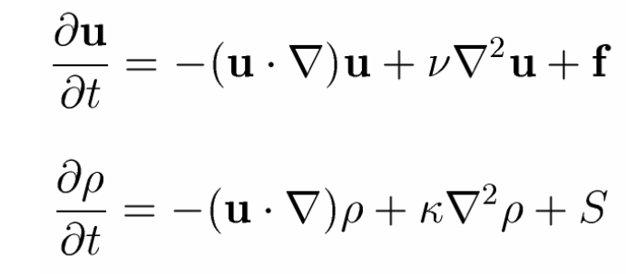
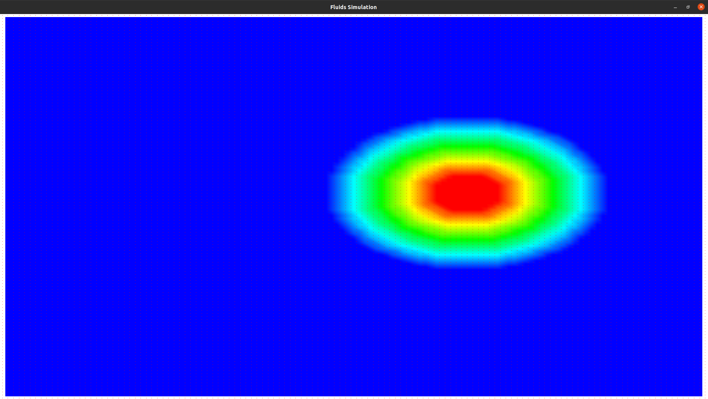
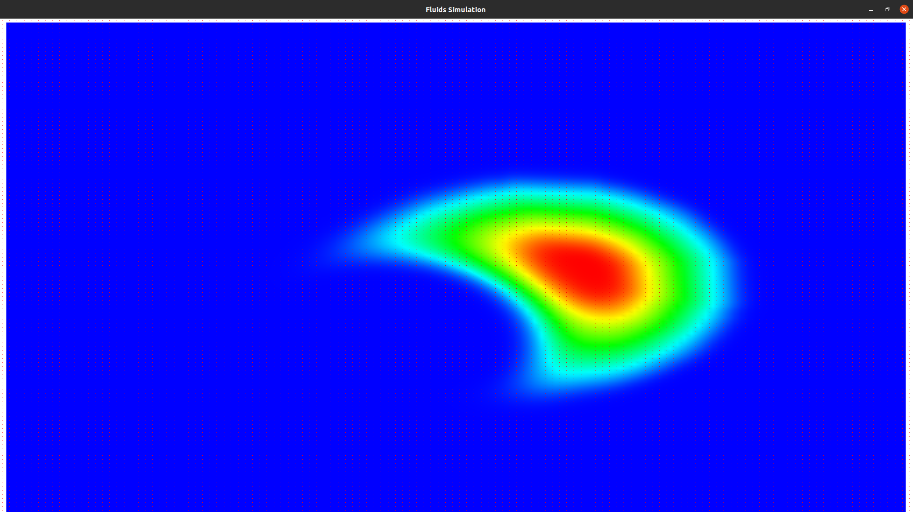
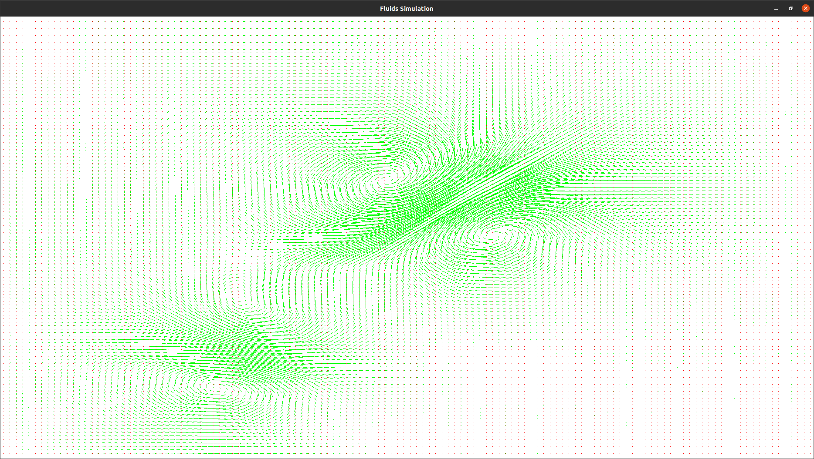

# Oil Spill Simulation
The aim of this project is to simulate the event of an oil spill as accurately as possible to use it for developing oill spill detection and thickness estimation algorithms.

# Some ocean waves theory
Mathematically, deep water waves are defined as those occurring in ocean depths greater than twice the wavelength of the wave. For example, if the wavelength of a particular wave is 10 meters, then the wave is considered a deep water wave if the depth of the ocean is greater than 5 meters where the wave is occurring.

- Philips Spectrum:
    - The Phillips spectrum is widely used in the real-time scene simulation of ocean waves. Structural analysis has shown the Phillips spectrum to be an instantaneous spatial spectrum. Its frequency spectrum agrees with the spectrum form raised by Neumann, and is close to the P-M spectrum. (Based on Tessendorf's paper on simulating ocean water)
- Fast Fourier transform:
    - Get frequency of height field of waves → Perform inverse FT to get a time representation of the waves (Height map at time **t**)
    - DFT vs FFT: DFT O(n^2) and FFT O(n log2 (n))
    - FFT algo → Cooley-Turkey (or Butterfly) algorithm

# Some fluid dynamics theory

There are three steps for the movement of a basic fluids simulation:
* Add forces from velocities or external factors
* Diffuse
* Move

This is inspired by the paper written by Jos Stam: [**Real-Time Fluid Dynamics for Games**](https://damassets.autodesk.net/content/dam/autodesk/research/publications-assets/pdf/realtime-fluid-dynamics-for.pdf)

To keep it simple:
* Diffusion means that each cell exchanges density with its direct neighbors
* Advection means that the density moves through a static velocity field (We could have some fixed velocity for example to simulate wind)

The ultimate goal is to solve the main physical equations of fluid flow (Such as the Navier-Stokes equation which gives us 
a description of the evolution of a velocity field over time).

The first equation represents the velocity equation (How the velocities change with time) and the second equation refers to 
the density function (How density moves through time).

# First simulations

Here is the start of the simulation where we introduced an oil spill ranging from 1 -> 10 mm.

After introducing velocity vectors from the south-west directed to the north-east, we get the following result after a couple of seconds of simulation.

You can take a look the velocity field that was introduced.

Two parameters are mainly responsible for the diffusion of the density of the liquid and its velocity vectors:
* Diffusion Coefficient: It is directly proportional to how fast the liquid density will diffuse (If no velocity vectors are acting on it, the liquid will start dispersing on its own)

Low diffusion coefficient (~0.1)     |  High diffusion coefficient (~0.42)
:-------------------------:|:-------------------------:
  |  

* Viscosity Coefficient: It is directly proportional to how fast the velocity vectors will diffuse (Viscous liquids are less affected by velocity vectors that non-viscous liquids)

The simulation's performance is acceptable, though the grid size should not exceed 250x250 in general.
Here is a full view of the oil spill simulation:

# To-Do

* Decide on the proper parameters to use for the oil spill simulation
* Tune the parameters to make the fluid as close as possible to actual oil (Viscosity, diffusion rate, ...)
* Test generated oil spills on oil spill detection and thickness ML models